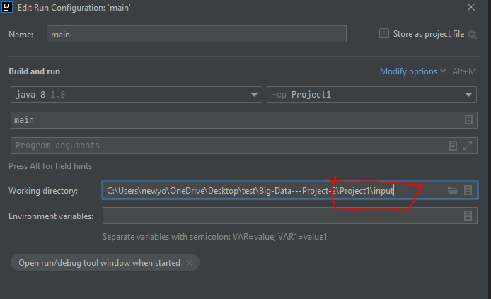

# User Interface Menu
Created a user menu (as well as a startup menu) that implements all CRUD operations and have a login system with two permission types (Admin and Basic). Passwords 
area encrypted and the options for querying data will be changed according to the project's database. An easy to access spark connection class is created and called 
upon for every spark session needed. All user interaction comes from the console application

## About
Jack Nguyen and Newyork Her created a menu for querying Project 2 data and also implemented a login system by creating a user menu. This menu has different permission types and an encrypted password

## Setting up
- First make sure your jdk is on 1.8.0 by going to File then click Project Structure

- Also be sure to delete the metastore data and spark warehouse files under input

- Rick click main and change modify run configuration working directory to project input

